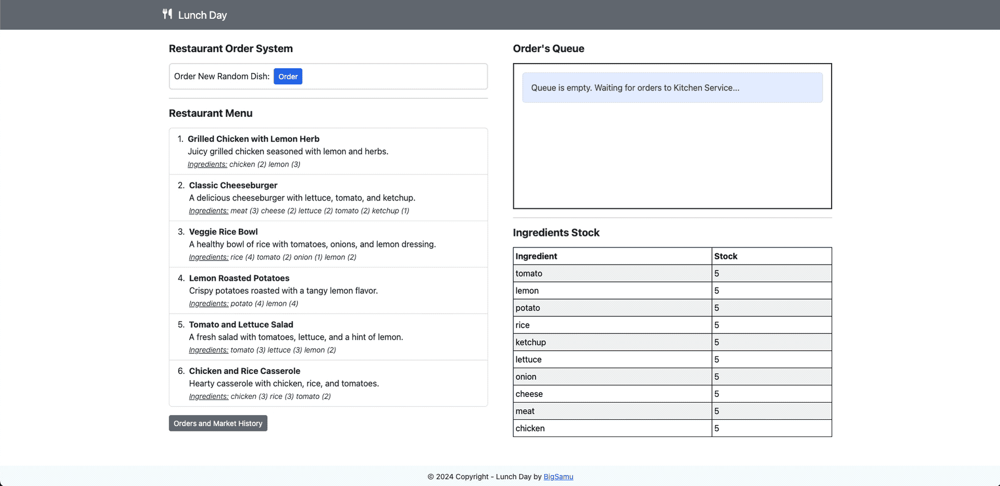

<a name="back-to-top"></a>

<!-- *********************************************************************** -->
<!-- 0.1) INTRO SHIELDS -->
<!-- *********************************************************************** -->

[![Github Follow][github-follow-badge]][github-follow-url]
[![License][license-badge]][license-url]
[![Forks][forks-badge]][forks-url]
[![Stars][stars-badge]][stars-url]
[![Watchers][watchers-badge]][watchers-url]
[![Ask Me Anything][ama-badge]][ama-url]
[![Say Thanks!][say-thanks-badge]][say-thanks-url]
[![Gmail Small][gmail-badge-small]][gmail-url]
[![LinkedIn Small][linkedin-badge-small]][linkedin-url]
[![Hackerrank Small][hackerrank-badge-small]][linkedin-url]

<!-- *********************************************************************** -->
<!-- 0.3) PROJECT TITLE -->
<!-- *********************************************************************** -->

<!-- omit in toc -->

# Restaurant Order System

A simple microservice application for a restaurant management system. Implemented with React, Vite, Express, Docker, RabbitMQ and SocketIO.

Demo available in following [link](http://15.229.232.201/)

<p align="left">
  
</p

<!-- *********************************************************************** -->
<!-- 0.2) TABLE OF CONTENTS -->
<!-- *********************************************************************** -->

<!-- omit in toc -->

## Table of Contents

- [Restaurant Order System](#restaurant-order-system)
  - [Table of Contents](#table-of-contents)
  - [About The Project](#about-the-project)
  - [Technologies](#technologies)
  - [Getting Started](#getting-started)
    - [Prerequisites](#prerequisites)
    - [Installation](#installation)
    - [Usage](#usage)
  - [Contact Me](#contact-me)

<p align="right">(<a href="#back-to-top">back to top</a>)</p>

---

<!-- *********************************************************************** -->
<!-- I) ABOUT THE PROJECT -->
<!-- *********************************************************************** -->

## About The Project

This project is a demo for a microservice-based restaurant management system 🍽️, designed to address the unique challenge of serving random free meals 🎉 during a special event. Utilizing a tech stack that includes React, Vite, Express, Docker, RabbitMQ, and SocketIO, it automates the flow from a manager's meal request 📋 to a kitchen 🧑‍🍳 and warehouse 🏭 service (i.e. ingredients retrieval and meal preparation, respectively). To handle mass orders efficiently 🚀, the design incorporates a solution with message broker services 📬 (i.e. RabbitMQ), facilitating asynchronous processing and communication between the kitchen and warehouse services. The system features automated recipe selection based on available ingredients 🥦🍅, real-time order tracking 📊, and seamless inventory management 📦, including automatic replenishment from a market API when stocks are low. It showcases how technology can streamline restaurant operations, handle mass orders efficiently, and maintain inventory, all within a flexible microservices architecture 🏗️.

<p align="right">(<a href="#back-to-top">back to top</a>)</p>

---

<!-- *********************************************************************** -->
<!-- II) TECHNOLOGIES -->
<!-- *********************************************************************** -->

## Technologies

The following technologies are used for the implementation of this project:

[![HTML5][html5-badge]][html5-url]
[![Javascript][javascript-badge]][javascript-url]
[![Node][node-badge]][node-url]
[![NPM][npm-badge]][npm-url]
[![React][react-badge]][react-url]
[![Vite][vite-badge]][vite-url]
[![Bootstrap][bootstrap-badge]][bootstrap-url]
[![ExpressJ][express-badge]][express-url]
[![Webpack][webpack-badge]][webpack-url]
[![Babel][babel-badge]][babel-url]
[![Mongo][mongodb-badge]][mongodb-url]
[![RabbitMQ][rabbitmq-badge]][rabbitmq-url]
[![Docker][docker-badge]][docker-url]
[![SocketIO][socket-io-badge]][socket-io-url]
[![Nginx][nginx-badge]][nginx-url]

Plus these platforms and tools for the development and deployment process:

[![VSCode][vscode-badge]][vscode-url]
[![Postman][postman-badge]][postman-url]
[![Github][github-badge]][github-url]
[![AWS][aws-badge]][aws-url]

<p align="right">(<a href="#back-to-top">back to top</a>)</p>

---

<!-- *********************************************************************** -->
<!-- III) GETTING STARTED -->
<!-- *********************************************************************** -->

## Getting Started

<!-- ----------------------------------------------------------------------- -->
<!-- 3.1) Prerequisites -->
<!-- ----------------------------------------------------------------------- -->

### Prerequisites

For the setup of this web application, the following prerequisites are required

- `Node.js` or greater and `(Node Package Manager) NPM`.
- `Docker`

For easy management of Node.js environments, [Node Version Manager (NVM)](https://github.com/nvm-sh/nvm#readme) tool is recommended.

<!-- 3.2) Installation -->
<!-- ----------------------------------------------------------------------- -->

### Installation

To get a copy of this project and run it in your local environment, follow the steps listed below.

1. Clone the repo
   ```sh
   git clone https://github.com/BigSamu/Restaurant_Order_System
   ```
2. Go into the repository

   ```sh
   cd Restaurant_Order_System
   ```

3. Create a .env.development file and update the enviroment variables that don't have values. Use as reference the `env.sample`. The env variables that required an update are the following:

```
NODE_ENV="development-or-production" # Change for "development" for this case
RESTAURANT_ORDER_SYSTEM_DOMAIN="<your-domain>"  # Change for "localhost" for this case
VITE_RESTAURANT_ORDER_SYSTEM_DOMAIN="your-domain" # Change for "localhost" for this case

DATABASE_USER="your-database-user" # mongo database user
DATABASE_PASSWORD="your-database-password" # mongo database password
DATABASE_NAME="your-database-name" # mongo database name
```

4. Run docker using the following script

```sh
./run.sh --dev
```

<p align="right">(<a href="#back-to-top">back to top</a>)</p>

<!-- ----------------------------------------------------------------------- -->
<!-- 3.3) Usage -->
<!-- ----------------------------------------------------------------------- -->

### Usage

After successful installation, you will be able to check the WebApp in any browser by visiting the following URL address: [http://localhost:3000](http://localhost:3000)

<p align="right">(<a href="#back-to-top">back to top</a>)</p>

---

<!-- *********************************************************************** -->
<!-- V) ACKNOWNLEDGEMENTS -->
<!-- *********************************************************************** -->

<!-- ## Acknowledgements


<p align="right">(<a href="#back-to-top">back to top</a>)</p>

--- -->

<!-- *********************************************************************** -->
<!-- V) CONTACT ME -->
<!-- *********************************************************************** -->

## Contact Me

Feel free to contact me if you have any doubt!

Samuel Valdes Gutierrez

[![Gmail][gmail-badge]][gmail-url]
[![Twitter][twitter-badge]][twitter-url]
[![LinkedIn][linkedin-badge]][linkedin-url]
[![HackerRank][hackerrank-badge]][hackerrank-url]

<p align="right">(<a href="#back-to-top">back to top</a>)</p>

---

<!-- *********************************************************************** -->
<!-- VI) SUPPORT -->
<!-- *********************************************************************** -->

<!-- ## Support

Whether you use this work to learn something or if you just like my work, please 🙏 consider supporting it. This aid will help me to dedicate more time to create and developed well design open-source projects.

[![Paypal][paypal-badge]][paypal-url]
[![Ko-Fi][ko-fi-badge]][ko-fi-url]
[![BuyMeACoffe][buy-me-a-coffee-badge]][buy-me-a-coffee-url]

<p align="right">(<a href="#back-to-top">back to top</a>)</p> -->

<!-- *********************************************************************** -->
<!-- VII) LICENSE -->
<!-- *********************************************************************** -->

<!-- ---

## License

This project is licensed under the terms of the MIT license.

> You can check out the full license [here](./LICENSE.md)

<p align="right">(<a href="#back-to-top">back to top</a>)</p>

--- -->

<!-- *********************************************************************** -->
<!-- VIII) FOOTER -->
<!-- *********************************************************************** -->

<p align="center">
Developed with ❤️ in Chile 🇨🇱
</p>

<!-- *********************************************************************** -->
<!-- A) MARKDOWN LINKS & IMAGES -->
<!-- *********************************************************************** -->

<!-- ----------------------------------------------------------------------- -->
<!-- A.1) Teachnologies -->
<!-- ----------------------------------------------------------------------- -->

<!-- 1) Programming Languages -->

<!-- HTML5 -->

[html5-badge]: https://img.shields.io/badge/HTML5-E34F26?logo=html5&logoColor=fff&style=for-the-badge
[html5-url]: https://dev.w3.org/html5/spec-LC/

<!-- Javascript -->

[javascript-badge]: https://img.shields.io/badge/JavaScript-F7DF1E?logo=javascript&logoColor=000&style=for-the-badge
[javascript-url]: https://www.javascript.com/

<!-- Python -->

[python-badge]: https://img.shields.io/badge/Python-3776AB?logo=python&logoColor=fff&style=for-the-badge
[python-url]: https://www.python.org/

<!-- Ruby -->

[ruby-badge]: https://www.ruby-lang.org/
[ruby-url]: https://www.ruby-lang.org/

<!-- 2) Frontend Frameworks and Libraries -->

<!-- ReactJS -->

[react-badge]: https://img.shields.io/badge/React-61DAFB?logo=react&logoColor=000&style=for-the-badge
[react-url]: https://reactjs.org/

<!-- Bootstrap -->

[bootstrap-badge]: https://img.shields.io/badge/bootstrap-%23563D7C.svg?style=for-the-badge&logo=bootstrap&logoColor=white
[bootstrap-url]: https://getbootstrap.com/

<!-- JQuery -->

[jquery-badge]: https://img.shields.io/badge/jQuery-0769AD?logo=jquery&logoColor=fff&style=for-the-badge
[jquery-url]: https://jquery.com/

<!-- Jinja -->

[jinja-badge]: https://img.shields.io/badge/Jinja-B41717?logo=jinja&logoColor=fff&style=for-the-badge
[jinja-url]: https://jinja.palletsprojects.com/

<!-- 3) Backend Frameworks and Libraries -->
<!-- Sinatra Ruby -->

[ruby-sinatra-badge]: (https://img.shields.io/badge/Ruby%20Sinatra-000?logo=rubysinatra&logoColor=fff&style=for-the-badge)
[ruby-sinatra-url]: https://sinatrarb.com/

<!-- Django -->

[django-badge]: https://img.shields.io/badge/Django-092E20?logo=django&logoColor=fff&style=for-the-badge
[django-url]: https://www.djangoproject.com/

<!-- Flask -->

[flask-badge]: https://img.shields.io/badge/Flask-000?logo=flask&logoColor=fff&style=for-the-badge
[flask-url]: https://flask.palletsprojects.com/

<!-- FastAPI -->

[fastapi-badge]: https://img.shields.io/badge/FastAPI-009688?logo=fastapi&logoColor=fff&style=for-the-badge
[fastapi-url]: https://fastapi.tiangolo.com/

<!-- ExpressJS -->

[express-badge]: https://img.shields.io/badge/Express-000?logo=express&logoColor=fff&style=for-the-badge
[express-url]: https://expressjs.com/

<!-- SocketIO -->

[socket-io-badge]: https://img.shields.io/badge/Socket.io-010101?logo=socketdotio&logoColor=fff&style=for-the-badge
[socket-io-url]: https://socket.io/

<!-- Mongoose -->

[mongoose-badge]: https://img.shields.io/badge/Mongoose-800?logo=mongoose&logoColor=fff&style=for-the-badge
[mongoose-url]: https://mongoosejs.com/

<!-- 4) Databases, Message Brokers, Caching Services, etc -->

<!-- SQLite -->

[sqlite-badge]: https://img.shields.io/badge/SQLite-003B57?logo=sqlite&logoColor=fff&style=for-the-badge
[sqlite-url]: https://sqlite.org/

<!-- Postgresql -->

[postgresql-badge]: https://img.shields.io/badge/PostgreSQL-4169E1?logo=postgresql&logoColor=fff&style=for-the-badge
[postgresql-url]: https://www.postgresql.org/

<!-- Mongo -->

[mongodb-badge]: https://img.shields.io/badge/MongoDB-47A248?logo=mongodb&logoColor=fff&style=for-the-badge
[mongodb-url]: https://www.mongodb.com/

<!-- RabbitMQ -->

[rabbitmq-badge]: https://img.shields.io/badge/RabbitMQ-F60?logo=rabbitmq&logoColor=fff&style=for-the-badge
[rabbitmq-url]: https://www.rabbitmq.com/

<!-- 5) Development Environments and Package Managers -->

<!-- NodeJS -->

[node-badge]: https://img.shields.io/badge/node.js-6DA55F?style=for-the-badge&logo=node.js&logoColor=white
[node-url]: https://nodejs.org/

<!-- NPM -->

[npm-badge]: https://img.shields.io/badge/npm-CB3837?logo=npm&logoColor=fff&style=for-the-badge
[npm-url]: https://www.npmjs.com/

<!-- RubyGems-->

[ruby-gems-badge]: https://img.shields.io/badge/RubyGems-E9573F?logo=rubygems&logoColor=fff&style=for-the-badge
[ruby-gems-url]: https://rubygems.org/

<!-- PyPI -->

[pypi-badge]: https://img.shields.io/badge/PyPI-3775A9?logo=pypi&logoColor=fff&style=for-the-badge
[pypi-url]: https://pypi.org/

<!-- 6) Tooling (Bundlers, Plugins, Transpilers, etc) -->

<!-- Vite -->

[vite-badge]: https://img.shields.io/badge/Vite-646CFF?logo=vite&logoColor=fff&style=for-the-badge
[vite-url]: https://vitejs.dev/
[webpack-badge]: https://img.shields.io/badge/Webpack-8DD6F9?logo=webpack&logoColor=000&style=for-the-badge
[webpack-url]: https://webpack.js.org/
[babel-badge]: https://img.shields.io/badge/Babel-F9DC3E?logo=babel&logoColor=000&style=for-the-badge
[babel-url]: https://babeljs.io/

<!-- 7) DevOps and Cloud -->

[aws-badge]: https://img.shields.io/badge/Amazon%20AWS-232F3E?logo=amazonaws&logoColor=fff&style=for-the-badge
[aws-url]: https://aws.amazon.com/
[docker-badge]: https://img.shields.io/badge/Docker-2496ED?logo=docker&logoColor=fff&style=for-the-badge
[docker-url]: https://www.docker.com/
[vercel-badge]: https://img.shields.io/badge/Vercel-000?logo=vercel&logoColor=fff&style=for-the-badge
[vercel-url]: https://vercel.com/
[nginx-badge]: https://img.shields.io/badge/NGINX-009639?logo=nginx&logoColor=fff&style=for-the-badge
[nginx-url]: https://www.nginx.com/

<!-- 8) Platforms and External Tools -->

[vscode-badge]: https://img.shields.io/badge/Visual%20Studio%20Code-007ACC?logo=visualstudiocode&logoColor=fff&style=for-the-badge
[vscode-url]: https://code.visualstudio.com/
[github-badge]: https://img.shields.io/badge/GitHub-181717?logo=github&logoColor=fff&style=for-the-badge
[github-url]: https://github.com/
[postman-badge]: https://img.shields.io/badge/Postman-FF6C37?logo=postman&logoColor=fff&style=for-the-badge
[postman-url]: https://www.postman.com/

<!-- ----------------------------------------------------------------------- -->
<!-- A.2) Github Stats -->
<!-- ----------------------------------------------------------------------- -->

<!-- Forks -->

[forks-badge]: https://img.shields.io/github/forks/BigSamu/Macaroons_Demo.svg
[forks-url]: https://github.com/BigSamu/Macaroons_Demo/network/members

<!-- Stargazers -->

[stars-badge]: https://img.shields.io/github/stars/BigSamu/Macaroons_Demo.svg
[stars-url]: https://github.com/BigSamu/Macaroons_Demo/stargazers

<!-- Watchers -->

[watchers-badge]: https://img.shields.io/github/watchers/BigSamu/Macaroons_Demo.svg
[watchers-url]: https://github.com/BigSamu/Macaroons_Demo/watchers

<!-- License -->

[license-badge]: https://img.shields.io/badge/license-MIT-green
[license-url]: ./LICENSE.md

<!-- Follow -->

[github-follow-badge]: https://img.shields.io/github/followers/BigSamu.svg?style=social&label=Follow
[github-follow-url]: https://github.com/BigSamu?tab=followers

<!-- ----------------------------------------------------------------------- -->
<!-- A.3) Contact -->
<!-- ----------------------------------------------------------------------- -->

<!-- Gmail -->

[gmail-badge]: https://img.shields.io/badge/Gmail-D14836?style=for-the-badge&logo=gmail&logoColor=white
[gmail-badge-small]: https://img.shields.io/badge/--gmail?label=Gmail&logo=Gmail&style=social
[gmail-url]: mailto:valdesgutierrez@gmail.com

<!-- Twitter -->

[twitter-badge]: https://img.shields.io/badge/Twitter-%231DA1F2.svg?style=for-the-badge&logo=Twitter&logoColor=white
[twitter-url]: https://twitter.com/BigSamu5

<!-- LinkedIn -->

[linkedin-badge]: https://img.shields.io/badge/linkedin-%230077B5.svg?style=for-the-badge&logo=linkedin&logoColor=white
[linkedin-badge-small]: https://img.shields.io/badge/--linkedin?label=LinkedIn&logo=LinkedIn&style=social
[linkedin-url]: https://www.linkedin.com/in/samuel-valdes-gutierrez

<!-- HackerRank -->

[hackerrank-badge]: https://img.shields.io/badge/-Hackerrank-2EC866?style=for-the-badge&logo=HackerRank&logoColor=white
[hackerrank-badge-small]: https://img.shields.io/badge/--hackerrank?label=HackerRank&logo=hackerrank&style=social
[hackerrank-url]: https://www.hackerrank.com/BigSamu

<!-- Ask Me Anything -->

[ama-badge]: https://img.shields.io/badge/Ask%20me-anything-1abc9c.svg
[ama-url]: #contact-me

<!-- Say Thanks -->

[say-thanks-badge]: https://img.shields.io/badge/Say%20Thanks-!-1EAEDB.svg
[say-thanks-url]: https://saythanks.io/to/BigSamu

<!-- ----------------------------------------------------------------------- -->
<!-- A.4) Support -->
<!-- ----------------------------------------------------------------------- -->

<!-- Paypal -->

[paypal-badge]: https://img.shields.io/badge/PayPal-00457C?style=for-the-badge&logo=paypal&logoColor=white
[paypal-url]: https://www.paypal.com/paypalme/BigSamu87/2

<!-- Ko-Fi -->

[ko-fi-badge]: https://img.shields.io/badge/Ko--fi-F16061?style=for-the-badge&logo=ko-fi&logoColor=white
[ko-fi-url]: https://ko-fi.com/BigSamu

<!-- Buy Me a Coffee -->

[buy-me-a-coffee-badge]: https://img.shields.io/badge/Buy%20Me%20a%20Coffee-ffdd00?style=for-the-badge&logo=buy-me-a-coffee&logoColor=black
[buy-me-a-coffee-url]: https://www.buymeacoffee.com/BigSamu

<!-- *********************************************************************** -->
<!-- B) INSTALLATION INSTRUCTIONS ENVIRONMENTS & PACKAGE MANAGERS -->
<!-- *********************************************************************** -->

<!-- Node.js and NPM -->

[install-node-and-npm-url]: https://gist.github.com/MichaelCurrin/aa1fc56419a355972b96bce23f3bccba

<!-- Ruby, Rubygems and Bundler -->

[install-ruby-and-bundler]: https://gist.github.com/MichaelCurrin/fb758aea4d35e03b9ed093afddf4e7ec

<!-- Python and pip -->

[install-python-and-pip]: https://realpython.com/installing-python/
